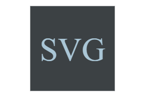

# SaVaGe Logos

  

## Description
This project is a command-line-generator for custom SVG logos. A user is provided 4 shape options (circle, square, triangle, diamond), an extensive color pallette, and the ability to input up to 3 text characters. After completing a short questionnaire, SaVaGe Logos renders a custom 300px by 200px SVG graphic. 

<i>NOTE</i>: Examples below are displayed at 50% actual logo size.

  

## Table of Contents

- [Installation](#installation)
- [Usage](#usage)
- [Tests](#tests)
- [Credits](#credits)
- [License](#license)
- [Contact](#contact)
  

## Installation

You can visit the SaVaGe Logos GitHub Repository at: https://github.com/SunnyOhK/SaVaGe-logos

This application uses npm code packages that must be installed prior to use:
- [Inquirer](https://github.com/SBoudrias/Inquirer.js#readme) - version 8.2.4

      npm install --save inquirer@^8.2.4
      
- [validate-color](https://github.com/dreamyguy/validate-color/blob/master/README.md) - version 2.2.4

      npm i validate-color
 

## Usage 
In order to begin creating your new logo, open the terminal from the index.js file and type `"node index.js"`. You will be prompted to answer 4 quick questions:
  1. What text would you like for your logo?
  2. What color would you like the text to be?
  3. Which shape would you prefer (circle, triangle, square, or diamond)?
  4. What color would you like for the shape to be?

Text input will accept uppercase letters, lowercase letters, numbers, and keyboard symbols, but quantity is capped at 3 total characters. 

Colors can be input as a keyword or hexadecimal code. For example:

&nbsp;&nbsp;▸&nbsp;&nbsp;&nbsp; #E4B6A8 =  &nbsp;&nbsp;&nbsp;&&nbsp;&nbsp;&nbsp;blueviolet = 

https://user-images.githubusercontent.com/127900916/235832687-12e76920-c99e-4321-85f2-aaa66135a230.mp4

Screencastify: https://drive.google.com/file/d/1SmOUV-PUxhdVYtNDNEMev0Y3s9i7bjuP/view

  

## Tests

Tests have been performed and passed using Jest (<i>A Delightful JavaScript Testing Framework</i>). In order to replicate and/or perform your own tests, please follow these steps from the command line terminal:
    
    npm install --save-dev jest
    npm test
&nbsp;&nbsp;&nbsp;&nbsp;<b>----- LATEST TEST RESULTS -----</b>

      PASS  tests/shape.test.js
      Test Suites: 1 passed, 1 total
      Tests:       6 passed, 6 total
 

## Credits

- Alex Gonzalez: EdX Tutor 
- Inquirer: https://github.com/SBoudrias/Inquirer.js#readme
- validate-color: &nbsp;&nbsp;&nbsp;&nbsp; https://dreamyguy.github.io/validate-color/
  

## License
This project is licensed under: [MIT](https://choosealicense.com/licenses/mit/)
  

## Questions

For questions, please contact me:

### GitHub: 
  &nbsp;&nbsp;&nbsp; [SunnyOhK](https://github.com/SunnyOhK)

### Project Link: 
  &nbsp;&nbsp;&nbsp; https://github.com/SunnyOhK/SaVaGe-logos
### Email: 
  &nbsp;&nbsp;&nbsp; 127900916+SunnyOhK@users.noreply.github.com
